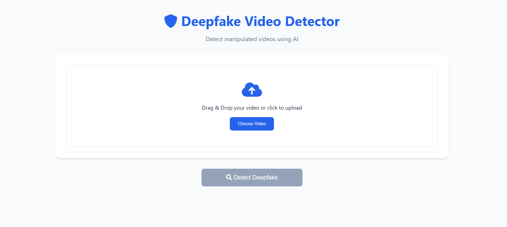

A deep learning-based web application that detects manipulated (deepfake) videos using a ResNet50-LSTM architecture. This tool helps identify AI-generated or manipulated video content with high accuracy.

##



## 🌟 Features

- **Advanced Deep Learning Model**: Combines ResNet50 features with LSTM temporal analysis for accurate deepfake detection
- **User-Friendly Interface**: Simple drag-and-drop or file selection for video uploads
- **Real-Time Analysis**: Processes videos and provides immediate results
- **Confidence Metrics**: Shows detection confidence percentage for transparency
- **Responsive Design**: Works on desktop and mobile devices

## 🧠 Model Architecture

The deepfake detection model uses a sophisticated architecture:

- **Feature Extraction**: ResNet50 processes video frames to extract facial features
- **Face Detection**: haarcascade_frontalface for accurate face detection in video frames
- **Temporal Analysis**: LSTM layers analyze sequences of frames to detect inconsistencies over time
- **Classification**: Determines if a video is real or fake with a confidence score

## 🛠️ Technologies Used

### Backend

- Python 3.8+
- TensorFlow/Keras
- Flask
- OpenCV
- NumPy
- haarcascade_frontalface

### Frontend

- HTML5
- CSS3
- JavaScript
- Font Awesome

## 📋 Prerequisites

- Python 3.8 or higher
- pip (Python package manager)
- 8GB+ RAM for video processing
- Modern web browser
- [Dataset](https://www.kaggle.com/datasets/ameencaslam/three-body-dataset)

## 🔧 Installation

1. **Clone the repository**

```shellscript
git clone https://github.com/yourusername/deepfake-detector.git
cd deepfake-detector
```

2. **Create a virtual environment (recommended)**

```shellscript
python -m venv venv

# On Windows
venv\Scripts\activate

# On macOS/Linux
source venv/bin/activate
```

3. **Install dependencies**

```shellscript
pip install -r requirements.txt
```

4. **Download the pre-trained model**

Place the [`best_model.keras`](DeepFake_Video_Detection.ipynb) file in the root directory of the project.

Note: I trained the model using [](https://colab.research.google.com/github/weiji14/deepbedmap/)

## 🚀 Usage

1. **Start the Flask server**

```shellscript
python app.py
```

2. **Access the web interface**

Open your browser and navigate to: `http://127.0.0.1:5000`

3. **Upload a video**

Drag and drop a video file or click to select one from your device.

4. **Analyze the video**

Click "Detect Deepfake" and wait for the analysis to complete.

5. **View results**

The application will display whether the video is real or fake, along with a confidence percentage.

## 📁 Project Structure

```plaintext
deepfake-detector/
├── app.py                  # Flask application
├── deepfake_detector.py    # Core detection functionality
├── requirements.txt        # Python dependencies
├── static/                 # Static files
│   ├── style.css           # CSS styles
│   └── script.js           # JavaScript functionality
├── templates/              # HTML templates
│   └── index.html          # Main page
└── uploads/                # Temporary storage for uploaded videos
```

## 🔍 How It Works

1. **Video Upload**: User uploads a video through the web interface
2. **Frame Extraction**: The system extracts frames from the video
3. **Face Detection**: haarcascade_frontalface detects faces in each frame
4. **Feature Extraction**: ResNet50 extracts features from the face regions
5. **Sequence Analysis**: LSTM layers analyze the temporal consistency
6. **Classification**: The model determines if the video is real or fake
7. **Result Display**: Results are displayed with confidence metrics

## 🔮 Future Improvements

- Add support for image deepfake detection
- Implement multi-face detection and analysis
- Improve processing speed for longer videos
- Add detailed analysis of which parts of the video appear manipulated
- Develop a mobile application version

## 📄 License

This project is licensed under the [MIT](LICENSE) License - see the LICENSE file for details.

## 🔗 Links

[](https://www.linkedin.com/in/balakrishna-kini?utm_source=share&utm_campaign=share_via&utm_content=profile&utm_medium=android_app)

⭐ If you find this project useful, please consider giving it a star on GitHub! ⭐
